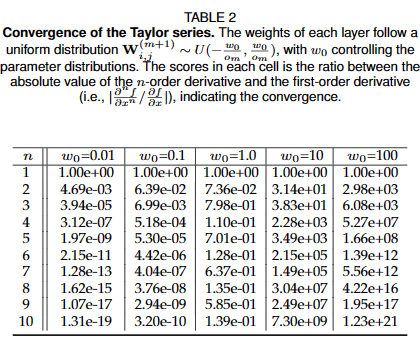

# HOPE: High-order Polynomial Expansion of Black-box Neural Networks

# 🚀Quickstart

## Installation Guide

### 1. Download project

    git clone https://github.com/HarryPotterXTX/HOPE.git
    cd HOPE

### 2. Prepare the Conda enviroments

    conda create -n HOPE python=3.10
    conda activate HOPE
    pip install -r requirements.txt

[Install PyTorch corresponding to your device](https://pytorch.org/get-started/locally/)

## Usage Guide

### 1. The accuracy of expansion


#### (a) Build some neural networks

    python demo/a_accuracy/code/network.py

The results are saved in "demo/a_accuracy/outputs".

#### (b) Expand neural networks with HOPE and Autograd
```
python demo/a_accuracy/code/expand.py -d demo/a_accuracy/outputs/1D_MLP_Sine/net.pt -r 5
```
```
python demo/a_accuracy/code/expand.py -d demo/a_accuracy/outputs/2D_Conv_AvePool/net.pt -r 2 -p 0,0 -o 8
```


All the derivatives are saved in "demo/a_accuracy/outputs/{project_name}/npy", and the approximation results are saved in "demo/a_accuracy/outputs/{project_name}/figs".


### 2. The convergence of Taylor series



#### (a) Build some neural networks with different w0

    python demo/b_convergence/code/net.py

#### (b) Expand all the neural networks

    python demo/b_convergence/code/expand.py

### 3. Function discovery

The original function is $y=\frac{x_1^2+x_2}{2}$

#### (a) Represent the function with implicit neural representation

    python demo/c_discovery/code/train.py

#### (b) Expand the network on reference inputs (0.0, 0.0), (0.5, 0.5), and (-0.5, -0.5)
```
python hope.py -d demo/c_discovery/outputs/discovery_2023_0716_104323/model/best.pt -o 2 -p 0,0
```

$$\begin{aligned}
y=-0.01+0.00 x_1+0.51 x_2+0.55 x_1^2-0.00 x_1 x_2+0.03 x_2^2 \approx 0.51 x_2+0.55 x_1^2
\end{aligned}$$

```
python hope.py -d demo/c_discovery/outputs/discovery_2023_0716_104323/model/best.pt -o 2 -p 0.5,0.5
```

$$\begin{aligned}
y&=0.38+0.54(x_1-0.5)+0.51(x_2-0.5)+0.53(x_1-0.5)^2+0.06(x_1-0.5)(x_2-0.5)+0.03(x_2-0.5)^2 \\
&=0.01-0.02 x_1+0.45 x_2+0.53 x_1^2+0.06 x_1 x_2+0.03 x_2^2 \\
&\approx 0.45 x_2+0.53 x_1^2
\end{aligned}$$

```
python hope.py -d demo/c_discovery/outputs/discovery_2023_0716_104323/model/best.pt -o 2 -p n0.5,n0.5
```

$$\begin{aligned}
y&=-0.13-0.51(x_1+0.5)+0.49(x_2+0.5)+0.50(x_1+0.5)^2
-0.07(x_1+0.5)(x_2+0.5)+0.02(x_2+0.5)^2 \\
&=-0.03-0.05 x_1+0.48 x_2+0.50 x_1^2-0.07 x_1 x_2+0.02 x_2^2 \\
&\approx 0.48 x_2+0.50 x_1^2
\end{aligned}$$

### 4. Heat maps


#### (a) Train an MNIST digit classifier

    python demo/d_heatmap/code/trainMNIST.py

#### (b) Separate it into ten equivalent single-output classifiers 

    python demo/d_heatmap/code/single_net.py -p demo/d_heatmap/outputs/MNIST_{time}

the results are saved in ''demo/4heatmap/outputs/MNIST_{time}/model/SingleOutput''

#### (c) Heat maps by HOPE and perturbation-based method

    python demo/d_heatmap/code/heatmaps.py -p demo/d_heatmap/outputs/MNIST_{time}

# Citations
```
@article 
{
    
}
```
# Contact
If you need any help or are looking for cooperation feel free to contact us.
xtx22@mails.tsinghua.edu.cn