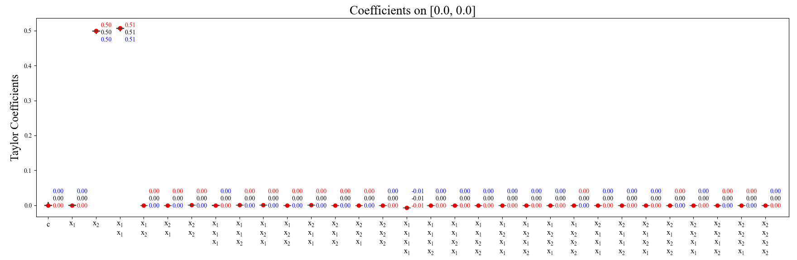
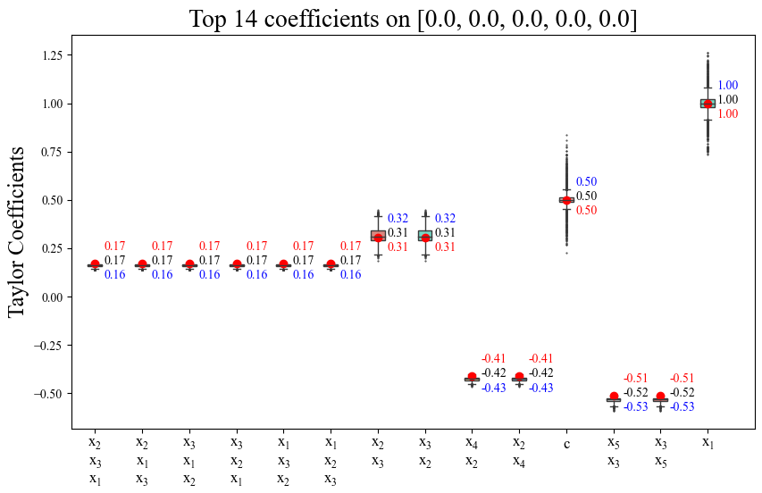

# HOPE: High-order Polynomial Expansion of Black-box Neural Networks

# 🚀Quickstart


## Installation Guide

### 1. Download project

    git clone https://github.com/HarryPotterXTX/HOPE.git
    cd HOPE

### 2. Prepare the Conda enviroments

    conda create -n HOPE python=3.10
    conda activate HOPE
    pip install -r requirements.txt

[Install PyTorch corresponding to your device](https://pytorch.org/get-started/locally/)

## Usage Guide

### 1. Expand ''black-box'' neural networks into explicit expressions


For the high-order Taylor expansion of neural networks, we provide two implementations, HOPE and Autograd. Users can conveniently compute high-order derivatives of neural networks and obtain Taylor series approximations for the network by calling **hope.py** or **auto.py**, while HOPE has significant advantages in terms of accuracy, speed, and memory cost compared with Autograd.

#### (a) Expand a 1-D neural network with HOPE

    python demo/expansion/code/net1d.py
    python hope.py -d demo/expansion/outputs/1D_MLP_Sine/net.pt -o 10 -p 0
    python plot.py -d demo/expansion/outputs/1D_MLP_Sine/npy/HOPE_[[0.0]]_10.npy -r 4.5

The results are saved in **demo/expansion/outputs/1D_MLP_Sine/figs/**.

#### (b) Expand a 2-D neural network with HOPE

    python demo/expansion/code/net2d.py
    python hope.py -d demo/expansion/outputs/2D_Conv_AvePool/net.pt -o 8 -p 0,0
    python plot.py -d demo/expansion/outputs/2D_Conv_AvePool/npy/HOPE_[[0.0,0.0]]_8.npy -r 2
    

The results are saved in **demo/expansion/outputs/2D_Conv_AvePool/figs/**.

### 2. Interpretation of deep neural networks and function discovery

#### (a) Represent $y=\frac{x_1^2+x_2}{2}$ with implicit neural representation

    python demo/discovery/code/train.py

<!-- Expand the network on reference inputs (0.0, 0.0), (0.5, 0.5), and (-0.5, -0.5)
```
python hope.py -d demo/discovery/outputs/discovery_{time}/model/best.pt -o 2 -p 0,0 -s
python hope.py -d demo/c_discovery/outputs/discovery_{time}/model/best.pt -o 2 -p 0.5,0.5 -s
python hope.py -d demo/c_discovery/outputs/discovery_{time}/model/best.pt -o 2 -p n0.5,n0.5 -s
```

$$\begin{aligned}
y&=-0.01+0.00 x_1+0.51 x_2+0.55 x_1^2-0.00 x_1 x_2+0.03 x_2^2  \hspace{100cm}\\
&\approx 0.51 x_2+0.55 x_1^2 \\
y&=0.38+0.54(x_1-0.5)+0.51(x_2-0.5)+0.53(x_1-0.5)^2+0.06(x_1-0.5)(x_2-0.5)+0.03(x_2-0.5)^2 \\
&=0.01-0.02 x_1+0.45 x_2+0.53 x_1^2+0.06 x_1 x_2+0.03 x_2^2 \\
&\approx 0.45 x_2+0.53 x_1^2 \\
y&=-0.13-0.51(x_1+0.5)+0.49(x_2+0.5)+0.50(x_1+0.5)^2
-0.07(x_1+0.5)(x_2+0.5)+0.02(x_2+0.5)^2 \\
&=-0.03-0.05 x_1+0.48 x_2+0.50 x_1^2-0.07 x_1 x_2+0.02 x_2^2 \\
&\approx 0.48 x_2+0.50 x_1^2
\end{aligned}$$

The aforementioned equations provide local explanations for this ''black-box'' neural network. When all these local explanations align and reach a consistent conclusion, a global explanation can be obtained. -->

Expand the network on multiple reference inputs  and find a global explanation
```
python global.py -d demo/discovery/outputs/discovery_{time}/model/best.pt
```


One can easily find the function expressed by the neural network from the top coefficients.

#### (b) Represent $y=0.5+x_1+0.6x_2x_3-0.8x_2x_4+x_1x_2x_3-x_3x_5$ with implicit neural representation

```
python demo/discovery/code/train1.py
```

Get the Taylor coefficients

```
python global.py -d demo/discovery/outputs/discovery1_3_{time}/model/best.pt -p 0,0,0,0,0 -o 3 -r 0.5 -n 3 -t 14
```



The local Taylor coefficients on reference point are marked in red, the average values of coefficients obtained from multiple reference points are marked in blue, and the coefficients that combine local and global properties are marked in black. The final Taylor polynomial on reference point [0, 0, 0, 0, 0] is $y=0.48+1.01x_1+0.58x_2x_3-0.80x_2x_4+1.02x_1x_2x_3-1.00x_3x_5$.

### 3. Feature selection


#### (a) Train an MNIST digit classifier

    python demo/heatmap/code/trainMNIST.py

#### (b) Separate it into ten equivalent single-output classifiers 

    python demo/heatmap/code/single_net.py -p demo/heatmap/outputs/MNIST_{time}

the results are saved in ''demo/heatmap/outputs/MNIST_{time}/model/SingleOutput''

#### (c) Heat maps by HOPE and perturbation-based method

    python demo/heatmap/code/heatmaps.py -p demo/heatmap/outputs/MNIST_{time}

# Citations
```
@article 
{
xiao2023hope,
title={HOPE: High-order Polynomial Expansion of Black-box Neural Networks},
author={Xiao, Tingxiong and Zhang, Weihang and Cheng, Yuxiao and Suo, Jinli},
journal={arXiv preprint arXiv:2307.08192},
year={2023}
}
```
# Contact
If you need any help or are looking for cooperation feel free to contact us.
xtx22@mails.tsinghua.edu.cn